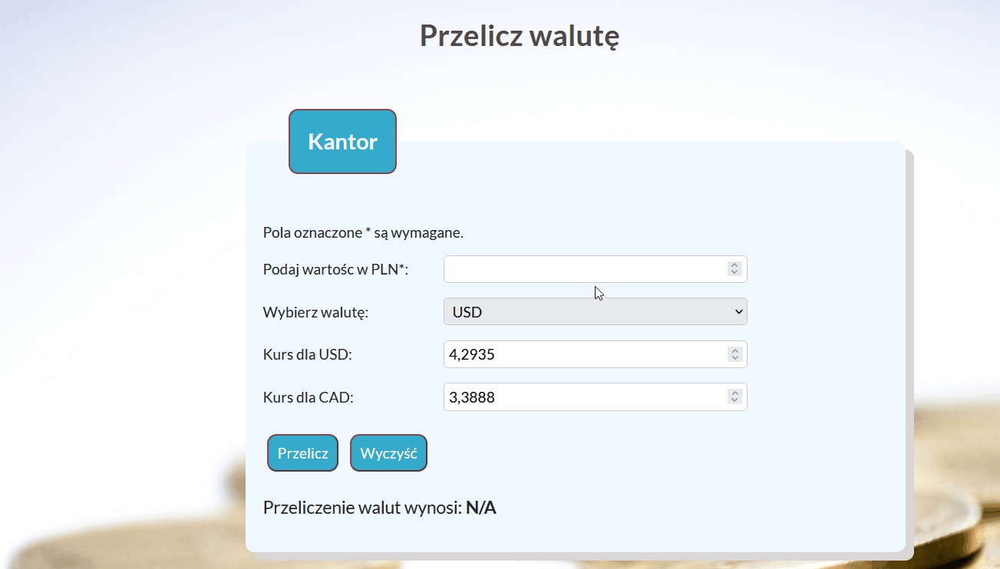

# currency-converter

## Description
Welcome on "Currency converter" website. I have created it in order to learn JavaScript in practilcal way. User can chose between two currency: USD and AUD. In this version of website, user need to provide an amount in PLN and rate for choosen currency. I invite you to have a look how it works :).
## Demo and preview
[Demo](https://iwona007.github.io/currency-converter/)

## Technology:
- JavaSript
- HtML5
- BEM
- Css
